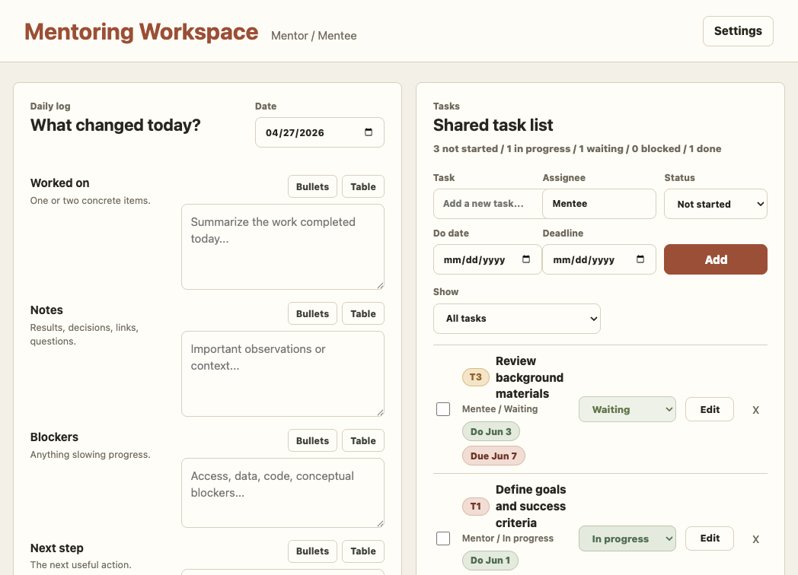
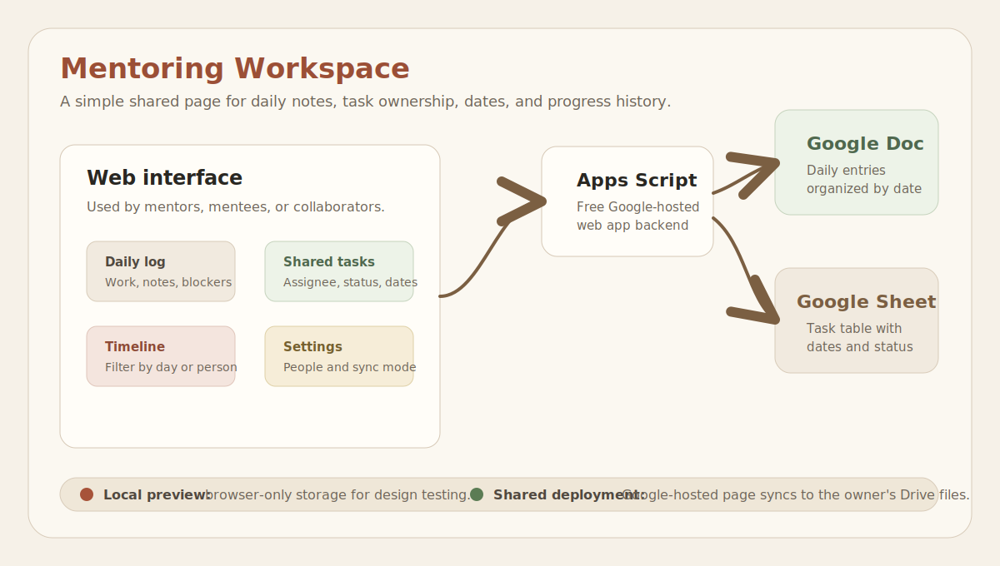
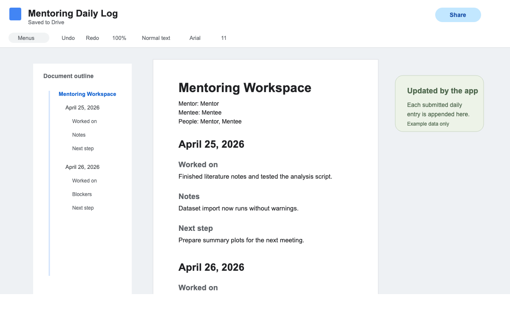
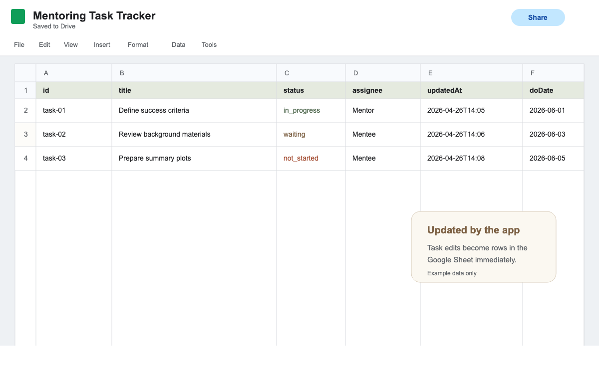

# Mentoring Workspace

A minimal collaborative tracker for mentors and mentees. It keeps daily entries, optional figures, shared tasks, assignees, do dates, deadlines, task statuses, and date-based timeline/calendar views in one simple interface.

The app can run in two ways:

- Local preview: opens in a browser and saves data only on that browser.
- Google Apps Script web app: the real shared version, backed by a Google Doc and Google Sheet.

## Project Links

- Source code: [github.com/alenzimic/mentoring-workspace](https://github.com/alenzimic/mentoring-workspace)
- Static preview: [alenzimic.github.io/mentoring-workspace](https://alenzimic.github.io/mentoring-workspace/)

## Interface Preview



## How It Works



## Google Sync Preview

These screenshots use example data only. In a real deployment, daily entries append to the Google Doc and task edits update rows in the Google Sheet.





## Sharing A Workspace

People who use the web app do not receive access to the deployer's Google Drive folders. The app runs through Google Apps Script and can only read or write the specific document and spreadsheet used by the project.

With the recommended deployment setting, `Anyone with Google account`, any signed-in Google user who has the web app URL can view and update that workspace through the app. For narrower access, deploy within your organization when available, or add an app-level allowlist before sharing the URL.

## What It Does

- Write daily progress entries.
- Attach an optional PNG, JPG, or GIF figure to a daily entry.
- Track tasks with assignees, statuses, do dates, and deadlines.
- View tasks and daily entries together by date as a list or calendar.
- Filter the timeline by text, type, person, status, and date.
- Sync daily entries and attached figures to a Google Doc.
- Sync tasks, daily entry text, and figure metadata to a Google Sheet.

## Quick Start For Users

The easiest way to use this with a mentor, mentee, intern, student, or collaborator is the Google Apps Script deployment:

1. Copy this project into your own GitHub account or download it.
2. Run the build command:

   ```bash
   npm run build:apps-script
   ```

3. Create a Google Apps Script project at [script.google.com](https://script.google.com/).
4. Add these files to Apps Script:
   - `google-apps-script/Code.gs`
   - `google-apps-script/Index.html`
   - `google-apps-script/appsscript.json`
5. Run `initializeProject` once from the Apps Script editor.
6. Approve the Google Docs and Google Sheets permissions.
7. Deploy as a web app:
   - Execute as: Me
   - Who has access: Anyone with Google account
8. Share the web app URL with the people using the workspace.

If `DOCUMENT_ID` and `SPREADSHEET_ID` are blank in `Code.gs`, the script creates a new Google Doc and Google Sheet in your Drive. If you already have files you want to use, paste their IDs into those fields before running `initializeProject`.

## Local Preview

Use this when editing or testing the interface:

```bash
npm run build:client
npm run start
```

Open:

```text
http://127.0.0.1:8766/
```

Local preview uses browser `localStorage`, so it is not shared across people or devices.

## GitHub Pages

GitHub Pages can publish a free static preview of the interface. That preview is useful for showing the design, but it cannot securely write to Google Docs or Google Sheets by itself.

Current static preview:

```text
https://alenzimic.github.io/mentoring-workspace/
```

For real collaboration, use the Google Apps Script web app URL.

## Privacy Notes

- Do not commit private Google Doc IDs, Google Sheet IDs, API keys, tokens, or credentials.
- The default `Code.gs` file leaves `DOCUMENT_ID` and `SPREADSHEET_ID` blank.
- The Google Doc and Google Sheet are created in the deploying user's Drive.
- Uploaded figures are appended to the Google Doc; the Sheet stores only the figure filename and description.
- Collaborators use the web app; they do not need access to this source repository unless they want to modify the code.

## Project Files

- `index.html`: local UI shell
- `styles.css`: visual system
- `src/`: editable client modules
- `app.js`: generated browser bundle
- `google-apps-script/Code.gs`: Google Doc and Google Sheet backend
- `google-apps-script/Index.html`: generated Apps Script UI bundle
- `google-apps-script/appsscript.json`: Apps Script manifest
- `.github/workflows/pages.yml`: optional GitHub Pages static preview workflow
- `tools/build-apps-script-index.js`: bundler for Apps Script

For detailed deployment steps, see `DEPLOYMENT.md`.
